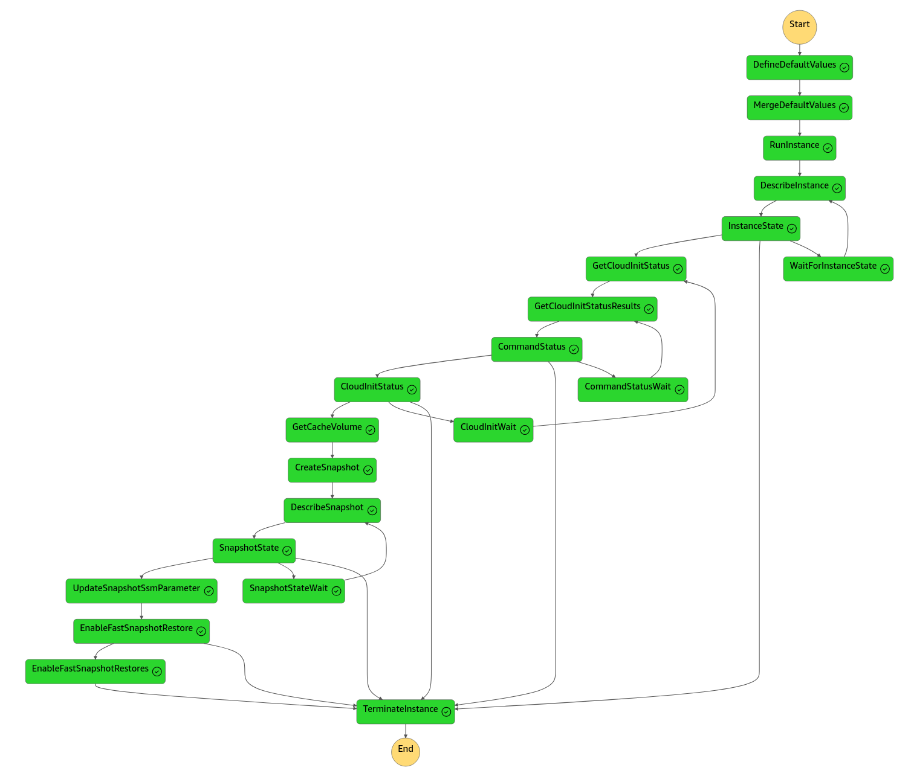

# ML Container Cache Builder

Resources used to build the EBS snapshot volume where the ML containers are stored.

## Prerequisites

Ensure that you have installed the following tools locally:

- [awscli](https://docs.aws.amazon.com/cli/latest/userguide/install-cliv2.html)
- [terraform](https://learn.hashicorp.com/tutorials/terraform/install-cli)

## Deploy

1. To provision the Terraform resources defined:

```sh
terraform init
terraform apply -auto-approve
```

This will create a state machine that can be used to build the EBS snapshot volume where the ML containers are stored. The instance size/resources may seem excessive, but this is to ensure that the images are pulled quickly and the EBS snapshot is created in a timely manner. However, the resources can be adjusted through the state machine input parameters as needed.

2. To build the EBS snapshot volume, you can start a state machine execution through the AWS console or through the awscli. A Terraform output `start_execution_command` has been provided to provide an example that can be modified and used to start the state machine execution:

```sh
aws stepfunctions start-execution \
  --region us-west-2 \
  --state-machine-arn arn:aws:states:us-west-2:111111111111:stateMachine:cache-builder \
  --input "{\"InstanceType\":\"c6in.24xlarge\",\"Iops\":10000,\"SnapshotDescription\":\"ML container image cache\",\"SnapshotName\":\"ml-container-cache\",\"Throughput\":1000,\"VolumeSize\":128}"
```

## Destroy

```sh
terraform destroy -auto-approve
```

## State Machine Diagram


